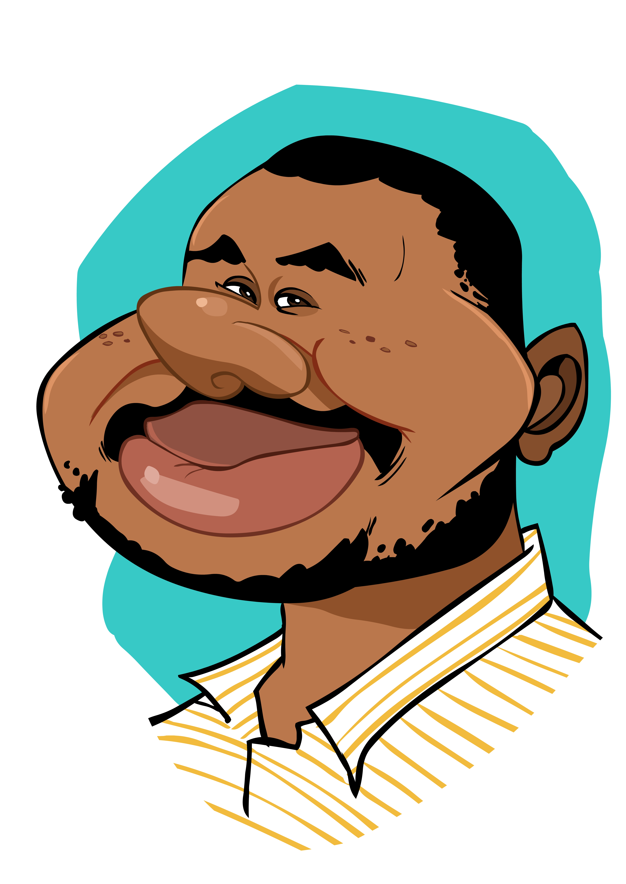

# Hi I'm **Tiyani Magomani.**

<picture >
  
</picture>

I am a Developer/Microsoft Dynamics 365 Specialist/Software Engineer who loves programming and solving real problems.\
Hobbies or interests traveling, music and continuous Learning new things everyday.\
Been in the industry for some time, seen technology trends come and go but the most interesting thing is learning never stops and the technology never stops evolving.

> ## Current involvements and projects

<picture >
  
</picture>

> * Nedbank Microsoft Dynamics 365 projects
> * Magomani Media Projects (Video Production & Radio)  
> * Nedbank Customizations and Custom Apps
>   * Angular projects
>   * React.js
>   * Microsoft SSIS
>   * Azure Development
>   * Microsoft Power Platform

Connect with me on:

* 🏢 [LinkedIn](https://www.linkedin.com/in/tiyani-magomani-23b33b71)
